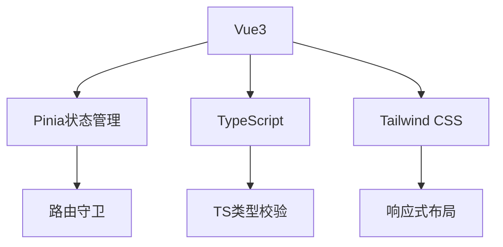

# SecLab 网络安全实训平台

[](https://vuejs.org/)
[](https://www.typescriptlang.org/)

在线演示：`http://security-lab:8080` (需配合后端服务)

## 📖 项目概述

网络安全攻防教学一体化平台，提供：

- 12大安全攻防实验场景（SQL注入/XSS/文件上传等）
- CTF竞赛模拟环境
- 红队武器库管理
- 实时攻防对抗沙箱
- 学员能力评估体系

## 🛠️ 功能模块

### 👨💻 学员端
- **课程中心** - 安全攻防课程学习（见[课程组件](src/pages/User/Courses/components/CourseOverView.vue)）
- **虚拟实验室** - Docker容器化实验环境（[实验模块](src/pages/Admin/Labs/index.vue)）
- **积分系统** - 实验积分与技能图谱（[积分页面](src/pages/User/Points/index.vue)）
- **社区交流** - 安全技术讨论区（[社区模块](src/pages/User/Community/index.vue)）

### 👮 管理端
- **课程管理** - 攻防课程CRUD（[管理界面](src/pages/Admin/Courses/create/create.vue)）
- **权限控制** - RBAC权限模型（[用户管理](src/pages/Admin/Users/index.vue)）
- **实验监控** - 实时实验状态追踪（[实验看板](src/pages/Admin/DashBoard/index.vue)）

## 🚀 技术架构

### 前端技术栈


### 部署架构
```bash
├── Docker容器化部署
│   ├── Nginx反向代理
│   ├── 自动构建镜像
│   └── 实验环境隔离
├── CI/CD流水线
│   ├── GitHub Actions
│   └── 自动化测试
```

## 🛠️ 安装部署

### 环境要求
- Node.js 18+
- Docker 24+
- PostgreSQL 15

### 快速启动
```bash
# 安装依赖
npm install

# 开发模式
npm run dev

# 生产构建
npm run build

# Docker部署
docker-compose up -d
```

## 📚 开发指南

### 项目结构
```bash
src/
├── pages/         # 业务页面
├── components/    # 通用组件
├── router/        # 路由配置
├── store/         # 全局状态
├── types/         # TS类型定义
└── mock/          # 模拟接口
```

### 代码规范
1. 组件命名遵循 PascalCase
2. TypeScript 严格模式
3. 提交信息符合 Conventional Commits
4. ESlint + Prettier 代码校验

## 📄 许可证
[MIT License](LICENSE)
